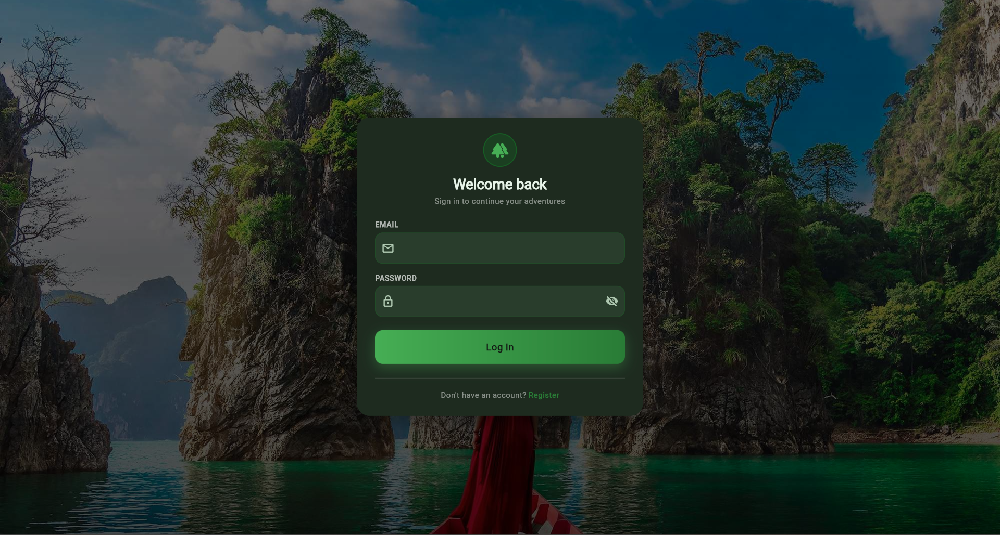
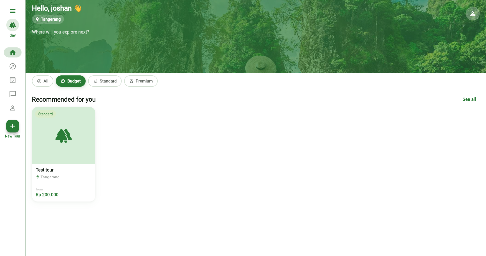

# DayTourity

Platform digital yang menghubungkan wisatawan dengan tour guide lokal terverifikasi secara praktis.

Aplikasi ini berkontribusi terhadap **SDG 8 (Decent Work and Economic Growth)** melalui digitalisasi sektor pariwisata mikro — memberikan standar pendapatan dan pengakuan profesional bagi pemandu lokal sekaligus memperluas akses pasar mereka.

---

### Tampilan Aplikasi

**1. Halaman Login** 

 

**2. Halaman Dashboard** 

---

## Fitur Utama

- **Seamless Booking** — Pemesanan jadwal tur langsung melalui satu platform
- **Advanced Search** — Cari guide berdasarkan lokasi, spesialisasi, dan bahasa
- **Cross-Platform** — Flutter untuk Android dan iOS
- **Detailed Price-view** — Rincian harga per aktivitas pada itinerary

---

## Technology Stack

| Layer | Teknologi |
|---|---|
| Frontend | Flutter (Dart) |
| Backend | NestJS (TypeScript) |
| Database | PostgreSQL (via Supabase) |

---

## Prasyarat

Pastikan tools berikut sudah terinstall sebelum memulai:

- [Node.js](https://nodejs.org/) v18 ke atas
- [Flutter SDK](https://docs.flutter.dev/get-started/install) versi terbaru
- npm (sudah termasuk dalam Node.js)

> Database sudah berjalan di Supabase — tidak perlu setup PostgreSQL lokal.

---

## Manual Guide
Silakan baca [Manual Instalasi dan Penggunaan (PDF)](Manual_Instalasi_dan_Penggunaan.pdf).

